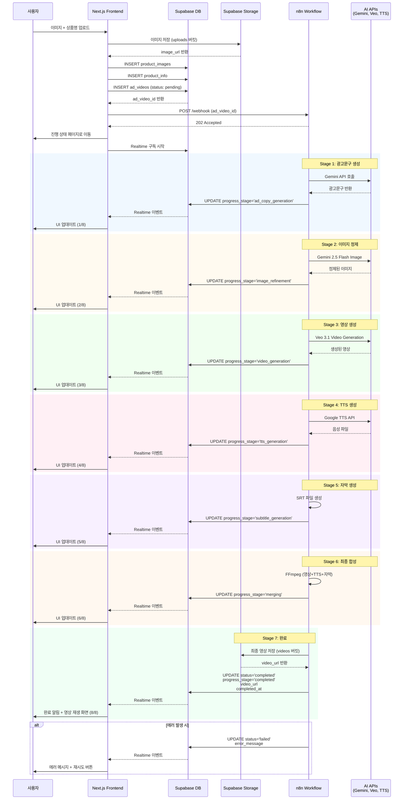
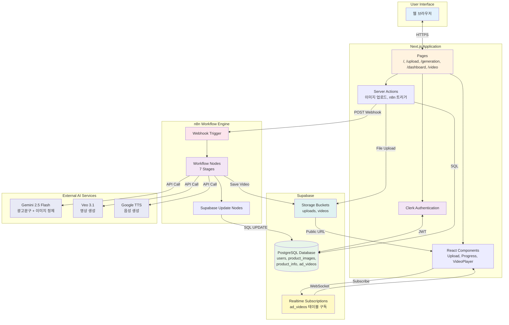
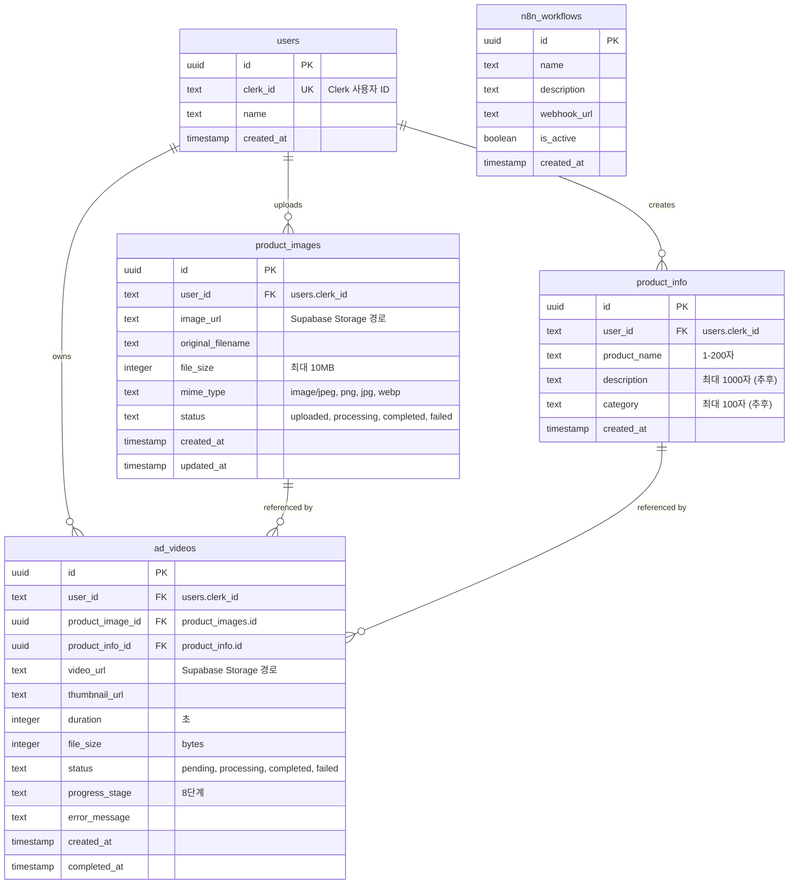
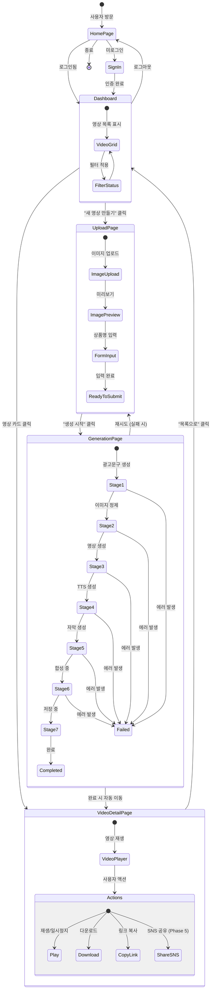
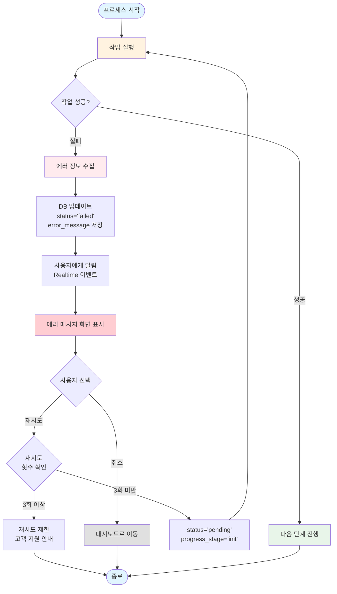
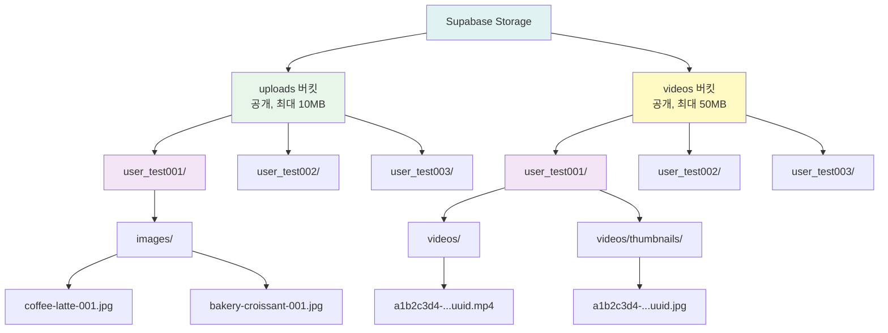
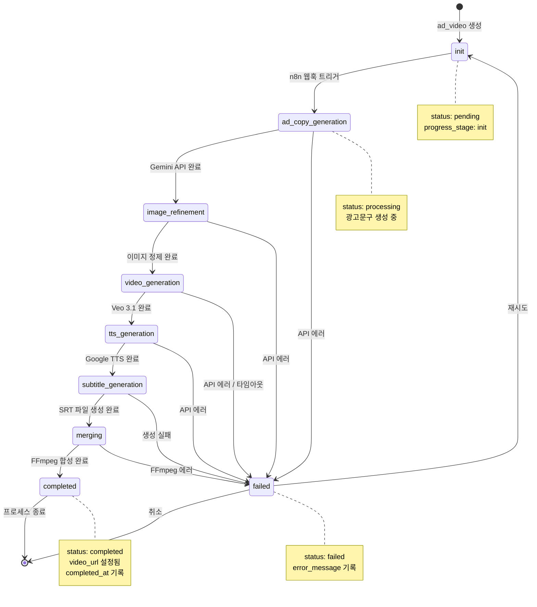

# AI 홍보영상 자동 생성 서비스 - User Flow

이 문서는 AI 홍보영상 자동 생성 서비스의 사용자 흐름을 시각화한 다이어그램입니다.

---

## 1. 전체 사용자 여정 (Main User Journey)

```mermaid
flowchart TD
    Start([사용자 방문]) --> Home[홈페이지<br/>'/']
    Home --> CheckAuth{로그인<br/>여부}

    CheckAuth -->|미로그인| SignIn[로그인/회원가입<br/>Clerk]
    CheckAuth -->|로그인됨| Dashboard[대시보드<br/>'/dashboard']

    SignIn --> SyncUser[사용자 동기화<br/>Clerk → Supabase]
    SyncUser --> Dashboard

    Dashboard --> Choice{작업 선택}
    Choice -->|새 영상 생성| Upload[업로드 페이지<br/>'/upload']
    Choice -->|기존 영상 확인| VideoList[영상 목록 조회]

    Upload --> UploadImage[이미지 업로드<br/>드래그앤드롭]
    UploadImage --> EnterName[상품명 입력]
    EnterName --> Submit[생성 시작 버튼]

    Submit --> SaveDB[(DB 저장<br/>product_images<br/>product_info<br/>ad_videos)]
    SaveDB --> TriggerN8N[n8n 웹훅 트리거]

    TriggerN8N --> Progress[진행 상태 페이지<br/>'/generation/[id]']
    Progress --> Realtime[Supabase Realtime<br/>실시간 업데이트]

    Realtime --> CheckStatus{생성 상태}
    CheckStatus -->|processing| Progress
    CheckStatus -->|completed| VideoDetail[영상 상세<br/>'/video/[id]']
    CheckStatus -->|failed| ErrorPage[에러 메시지<br/>+ 재시도 버튼]

    ErrorPage -->|재시도| Submit

    VideoDetail --> Actions{사용자 액션}
    Actions -->|재생| Play[영상 재생]
    Actions -->|다운로드| Download[영상 다운로드]
    Actions -->|공유| Share[링크 복사<br/>SNS 공유]

    VideoList --> VideoDetail

    Play --> End([완료])
    Download --> End
    Share --> End

    style Start fill:#e1f5ff
    style Home fill:#fff3e0
    style SignIn fill:#f3e5f5
    style Upload fill:#e8f5e9
    style Progress fill:#fff9c4
    style VideoDetail fill:#e0f2f1
    style ErrorPage fill:#ffebee
    style End fill:#e1f5ff
```

---

## 2. 영상 생성 프로세스 (Video Generation Process)



---

## 3. 시스템 아키텍처 플로우 (System Architecture)



---

## 4. 데이터베이스 관계도 (Database ERD)



---

## 5. 페이지 네비게이션 플로우 (Page Navigation)



---

## 6. 에러 핸들링 플로우 (Error Handling)



---

## 7. Supabase Storage 구조 (Storage Structure)



---

## 8. 진행 단계 상태 전이도 (Progress Stage Transitions)



---

## 참고사항

### 색상 코드
- 🔵 파란색: 시작/종료 상태
- 🟡 노란색: 진행 중 상태
- 🟢 초록색: 성공 상태
- 🔴 빨간색: 에러 상태
- 🟣 보라색: 인증 관련
- 🟠 주황색: 외부 서비스

### 주요 URL
- 홈: `/`
- 업로드: `/upload`
- 진행 상태: `/generation/[id]`
- 대시보드: `/dashboard`
- 영상 상세: `/video/[id]`

### 웹훅 URL
```
http://localhost:5678/webhook/6632eae6-fcdf-4f22-9f71-298989a39734
```

### 데이터베이스 상태
- **status**: `pending`, `processing`, `completed`, `failed`
- **progress_stage**: `init`, `ad_copy_generation`, `image_refinement`, `video_generation`, `tts_generation`, `subtitle_generation`, `merging`, `completed`

---

_작성일: 2025-01-06_
_버전: 1.0.0_
_기반 문서: PRD.md, my_ad_schema.sql_
